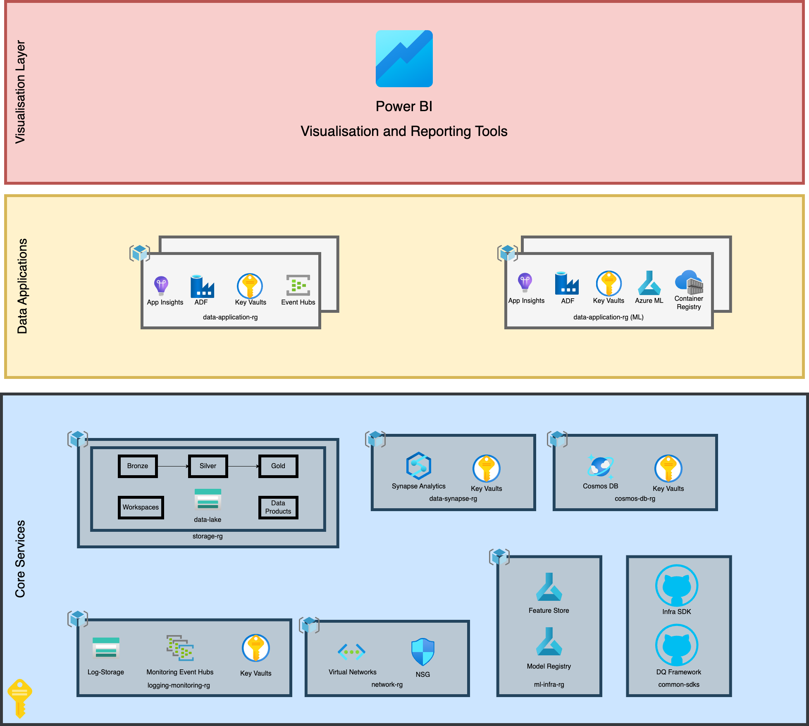
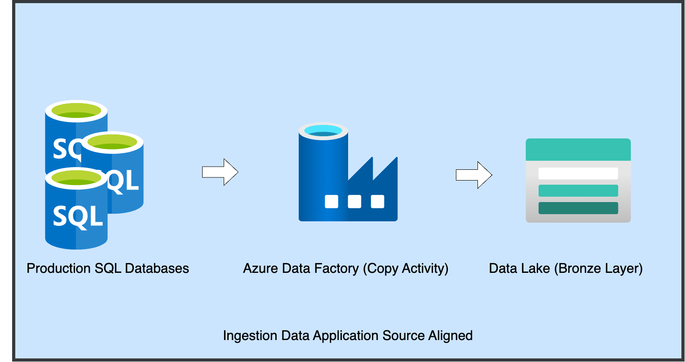

# Data Architecture on Azure

When choosing an architecture, it's important to optimise for technical features such as scalability, high availability, disaster recovery, cost efficiency, performance optimisation, observability, and security and governance. It should also align with business requirements, enabling self-service capabilities and data democratisation to empower data-driven decision-making. Additionally, it should also consider the skill sets of the end users and the in-house expertise available to support the architecture.

This repository provides an overview of a data architecture solution built on Azure, utilising multiple Azure services for data ingestion, processing, storage, analytics, machine learning, and monitoring. Each Azure tool is selected to fulfill a specific role in the architecture based on its specialised capabilities and role as a best-practice solution in Azure's ecosystem.

---

## Table of Contents

1. [Architecture Overview](#architecture-overview)
2. [Component Details](#component-details)
   - [Azure Data Factory](#azure-data-factory)
   - [Storage Accounts](#storage-accounts)
   - [Synapse Analytics](#synapse-analytics)
   - [Azure Machine Learning](#azure-machine-learning)
   - [Application Insights](#application-insights)
   - [Cosmos DB](#cosmos-db)
   - [Event Hubs](#event-hubs)
3. [Why These Azure Tools?](#why-these-azure-tools)

---

## 1. Architecture Overview

The primary components of this Azure-based data architecture are as follows:

1. **Azure Data Factory** - Acts as the main orchestrator for data workflows.
2. **Storage Accounts** - Serves as the data lake, storing raw, transformed, and processed data.
3. **Synapse Analytics** - Provides advanced analytics, data warehousing, and compute resources for large-scale data processing.
4. **Azure Machine Learning** - Used to train and deploy machine learning models on the data.
5. **Application Insights** - Handles telemetry and logging, providing deep insights into application and pipeline performance.
6. **Cosmos DB** - Serves as a source for real-time data ingestion for specific jobs.
7. **Event Hubs** - Manages the streaming of Change Data Capture (CDC) events from OLTP systems.

Each component has a dedicated role, providing an efficient, scalable, and robust data architecture on Azure.

---

## 2. Component Details

### 2.1 Azure Data Factory

**Purpose:** Azure Data Factory (ADF) is the orchestrator of the architecture, managing workflows and data movement between components.

- **Key Features:** 
  - Supports a range of data ingestion, transformation, and loading (ETL) activities.
  - Integrates seamlessly with Azure and third-party data sources.
  - Provides monitoring and automation, making it an ideal choice for managing complex workflows.

### 2.2 Storage Accounts

**Purpose:** Storage Accounts in Azure are used to build a common data lake that holds both raw and processed data in different containers.

- **Key Features:** 
  - Highly scalable storage with tiered data access (hot, cool, and archive).
  - Blobs and data lake capabilities make it suitable for storing unstructured and structured data.
  - Integration with ADF, Synapse, and Azure ML for seamless data access across stages.

### 2.3 Synapse Analytics

**Purpose:** Synapse Analytics is the compute and warehousing component, ideal for large-scale data processing and analytics.

- **Key Features:**
  - Combines big data and data warehousing capabilities in a single platform.
  - Spark and SQL pools support both batch processing and on-demand querying.
  - Scalable compute options ensure performance efficiency even with high-volume workloads.

### 2.4 Azure Machine Learning

**Purpose:** Azure Machine Learning provides the necessary tools to train, validate, and deploy machine learning models.

- **Key Features:**
  - Integrated with various data sources on Azure, simplifying data preparation and feature engineering.
  - Supports MLOps (Machine Learning Operations) for deploying, monitoring, and managing models in production.
  - AutoML, experimentation, and model registries accelerate the ML lifecycle.

### 2.5 Application Insights

**Purpose:** Application Insights is used for telemetry and logging, tracking application health and diagnosing issues.

- **Key Features:**
  - Provides live metrics, customisable alerts, and logging for deep insights.
  - Integrates with ADF, Synapse, and other services for unified monitoring across the architecture.
  - Facilitates root cause analysis, optimising pipeline performance and minimising downtime.

### 2.6 Cosmos DB

**Purpose:** Cosmos DB is a NoSQL database designed for real-time data processing and event-driven jobs.

- **Key Features:**
  - Globally distributed, low-latency storage with multi-region replication.
  - Change Feed capabilities allow for real-time data updates, suitable for streaming and reactive workflows.
  - Flexibility in data modeling, with support for document, key-value, graph, and columnar data models.

### 2.7 Event Hubs

**Purpose:** Event Hubs is used for streaming Change Data Capture (CDC) events from OLTP systems, providing real-time insights.

- **Key Features:**
  - Capable of handling millions of events per second, ideal for high-throughput scenarios.
  - Integrates with ADF, Synapse, and Cosmos DB, ensuring data flows seamlessly across the architecture.
  - Reliable ingestion pipeline for real-time analytics, IoT data, and event-driven architectures.

---

## Why These Azure Tools?

All of the tools chosen are the go-to solutions in Azure for their respective use cases, as they provide optimal performance, scalability, and integration within the Azure ecosystem. This architecture leverages these tools to build a reliable, high-performance, and fully managed solution for data processing, storage, and analytics.


## Architecture Diagrams

### High Level Architecture Diagram


### Sample Data Ingestion Pipeline

Let’s consider an example of a source-aligned data application. In this context, ***"source-aligned"*** refers to applications where the data originates from an external source rather than being stored in the data lake. On the other hand, ***"curated data applications"*** takes a dataset already in the data lake—whether from another source-aligned product or a curated data product—and transform it into a new dataset. 

This code snippet is a direct conversion to terraform of the JSON template used in the Azure Data Factory's copy data activity. The official documentation [link here](https://learn.microsoft.com/en-us/azure/data-factory/copy-activity-overview)

```
resource "azurerm_data_factory_pipeline" "example_pipeline" {
  name                = "example_pipeline"
  resource_group_name = "your-resource-group"
  data_factory_name   = "your-data-factory-name"

  activity {
    name = "CopyActivityTemplate"
    type = "Copy"

    inputs = [
      {
        reference_name = "<source dataset name>"
        type           = "DatasetReference"
      }
    ]

    outputs = [
      {
        reference_name = "<sink dataset name>"
        type           = "DatasetReference"
      }
    ]

    type_properties = jsonencode({
      source = {
        type       = "<source type>"
        # Add specific source properties here, e.g., "sqlTable": "your_table_name"
      }
      sink = {
        type       = "<sink type>"
        # Add specific sink properties here, e.g., "sinkType": "AzureBlob"
      }
      translator = {
        type           = "TabularTranslator"
        columnMappings = "<column mapping>"
      }
      dataIntegrationUnits        = <number>
      parallelCopies              = <number>
      enableStaging               = <true_or_false>
      stagingSettings             = {
        # Define staging properties if enableStaging is true
      }
      enableSkipIncompatibleRow   = <true_or_false>
      redirectIncompatibleRowSettings = {
        # Define redirect settings if enableSkipIncompatibleRow is true
      }
    })
  }
}
```
**Ingestion Data Application**


### Sample Bronze to Silver Layer Transformation
Let's assume we now have a Players table in the Bronze layer with the following schema:
## Table: Players

| Column Name       | Data Type       | Description                                                                                 |
|-------------------|-----------------|---------------------------------------------------------------------------------------------|
| **PlayerID**      | INT (Primary Key) | Unique identifier for each player.                                                        |
| **FirstName**     | VARCHAR(50)     | Player's first name.                                                                      |
| **LastName**      | VARCHAR(50)     | Player's last name.                                                                       |
| **DateOfBirth**   | DATE            | Player's date of birth.                                                                   |
| **Nationality**   | VARCHAR(50)     | Country or nationality of the player.                                                     |
| **Position**      | VARCHAR(20)     | Position on the field (e.g., Forward, Midfielder, Defender, Goalkeeper).                  |
| **Club**          | VARCHAR(50)     | Current club or team the player is contracted to.                                         |
| **MarketValue**   | DECIMAL(15, 2)  | Estimated market value of the player in millions (currency assumed to be euros or USD).   |
| **ContractEndDate** | DATE          | Date when the player’s contract with the current club expires.                            |
| **SkillRating**   | DECIMAL(3, 1)   | Overall skill rating of the player (e.g., on a scale of 0 to 100 or 1 to 10).             |
| **Pace**          | DECIMAL(3, 1)   | Speed and agility rating of the player.                                                   |
| **Dribbling**     | DECIMAL(3, 1)   | Dribbling ability rating.                                                                 |
| **Shooting**      | DECIMAL(3, 1)   | Shooting skill rating.                                                                    |
| **Passing**       | DECIMAL(3, 1)   | Passing skill rating.                                                                     |
| **Defending**     | DECIMAL(3, 1)   | Defensive skill rating.                                                                   |
| **Physical**      | DECIMAL(3, 1)   | Physicality rating, representing strength and stamina.                                    |
| **PreferredFoot** | VARCHAR(10)     | Indicates the player’s preferred foot (e.g., Left, Right, Both).                          |
| **Appearances**   | INT             | Total number of professional appearances the player has made.                             |
| **Goals**         | INT             | Total career goals scored by the player.                                                  |
| **Assists**       | INT             | Total career assists made by the player.                                                  |
| **YellowCards**   | INT             | Total number of yellow cards received.                                                    |
| **RedCards**      | INT             | Total number of red cards received.                                                       |
| **InjuryStatus**  | VARCHAR(20)     | Current injury status (e.g., Healthy, Injured, Recovering).                               |
| **LastUpdated**   | DATETIME        | Timestamp of the last update to this player’s record.                                     |

---

### PySpark Code for Cleaning `Players` Table Data for Silver Layer

```python
from pyspark.sql import SparkSession
from pyspark.sql.functions import col, lit, when, lower, trim, current_timestamp
from pyspark.sql.types import StructType, StructField, DoubleType, IntegerType, StringType, DateType

# Initialize Spark Session
spark = SparkSession.builder.appName("PlayersDataCleaning").getOrCreate()

# Define Schema for Data Type Casting
player_schema = StructType([
    StructField("PlayerID", IntegerType(), True),
    StructField("FirstName", StringType(), True),
    StructField("LastName", StringType(), True),
    StructField("DateOfBirth", DateType(), True),
    StructField("Nationality", StringType(), True),
    StructField("Position", StringType(), True),
    StructField("Club", StringType(), True),
    StructField("MarketValue", DoubleType(), True),
    StructField("ContractEndDate", DateType(), True),
    StructField("SkillRating", DoubleType(), True),
    StructField("Pace", DoubleType(), True),
    StructField("Dribbling", DoubleType(), True),
    StructField("Shooting", DoubleType(), True),
    StructField("Passing", DoubleType(), True),
    StructField("Defending", DoubleType(), True),
    StructField("Physical", DoubleType(), True),
    StructField("PreferredFoot", StringType(), True),
    StructField("Appearances", IntegerType(), True),
    StructField("Goals", IntegerType(), True),
    StructField("Assists", IntegerType(), True),
    StructField("YellowCards", IntegerType(), True),
    StructField("RedCards", IntegerType(), True)
])

# Load the Bronze Layer Data
def load_bronze_data(input_path):
    return spark.read.parquet(input_path)

# Function to fill null values with a default value
def fill_null_with_default(df, column, default_value):
    return df.withColumn(column, when(col(column).isNull(), lit(default_value)).otherwise(col(column)))

# Step 1: Remove Duplicates
def remove_duplicates(df):
    return df.dropDuplicates(["PlayerID"])

# Step 2: Handle Null Values
def handle_null_values(df):
    # Define columns with default values
    default_values = {
        "FirstName": "Unknown",
        "LastName": "Unknown",
        "MarketValue": 0.0,
        "SkillRating": 0.0
    }
    # Apply null handling using transform and fill_null_with_default function
    for column, default_value in default_values.items():
        df = df.transform(lambda d: fill_null_with_default(d, column, default_value))
    return df

# Step 3: Standardize Text Columns
def standardize_text_columns(df):
    text_columns = ["FirstName", "LastName", "Nationality", "Position", "Club", "PreferredFoot"]
    for column in text_columns:
        df = df.withColumn(column, trim(lower(col(column))))
    return df

# Step 4: Dynamic Casting Using Schema
def cast_data_types(df, schema):
    for field in schema.fields:
        # Only cast if the column exists in the DataFrame to avoid errors
        if field.name in df.columns:
            df = df.withColumn(field.name, col(field.name).cast(field.dataType))
    return df

# Step 5: Add Metadata Columns
def add_metadata_columns(df):
    return df.withColumn("LastUpdated", current_timestamp())

# Main function to execute the data cleaning pipeline
def clean_players_data(input_path, output_path):
    # Load Bronze data
    df = load_bronze_data(input_path)
    
    # Apply transformations
    df = (df
          .transform(remove_duplicates)
          .transform(handle_null_values)
          .transform(standardize_text_columns)
          .transform(lambda d: cast_data_types(d, player_schema))
          .transform(add_metadata_columns))
    
    # Write the cleaned data to Silver Layer
    df.write.mode("overwrite").parquet(output_path)
    print(f"Data successfully written to {output_path}")

# Example Usage
input_bronze_path = "/path/to/bronze/players"
output_silver_path = "/path/to/silver/players"

clean_players_data(input_bronze_path, output_silver_path)
```